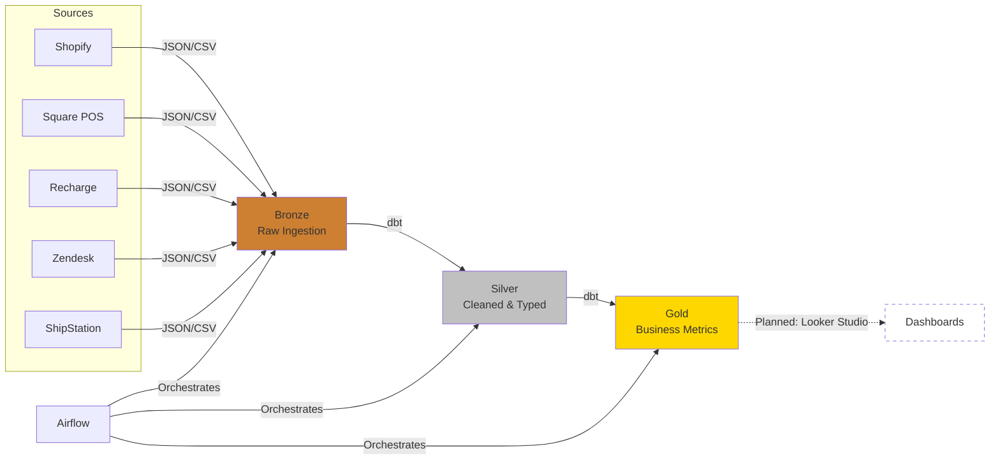

# Brewline Coffee Co. — Data Platform
[](https://python.org)
[](https://www.getdbt.com/)
[](https://github.com/duckdb/dbt-duckdb)
[](https://github.com/dbt-labs/dbt-adapters)
[](https://airflow.apache.org)
[](https://duckdb.org)
[](https://cloud.google.com/bigquery)
[](https://github.com/mr-fadli/brewline-data-platform/actions)


A production-style ELT pipeline built to satisfy a fictional business requirement from Brewline Coffee Co., a coffee subscription + retail company needing unified revenue, churn, and refund-alert reporting across 5 disconnected source systems (Shopify, Square POS, Recharge, Zendesk, ShipStation).

This project was built as a portfolio piece simulating a real engineering engagement: a stakeholder persona (played by Claude, Anthropic's AI) supplied an intentionally incomplete business requirement, and the project was built by asking clarifying questions, making — and documenting — real design decisions under ambiguity, and iterating through four stages of increasing production-readiness. See `docs/business_requirement.md` and `docs/stakeholder_discussion_log.md` for the original requirement-gathering process this pipeline was built to satisfy, and `docs/design_decisions_log.md` for the synthesis and design review that followed.

## Architecture

Medallion architecture (bronze → silver → gold), built in four stages:

| Stage | What | Stack |
|---|---|---|
| 1 | Local pipeline, hand-orchestrated | Python, DuckDB, SQL |
| 2 | Silver/gold transformations + tests | dbt-duckdb |
| 3 | Scheduled orchestration | Airflow, Docker (task-isolated containers) |
| 4 | Cloud data warehouse | GCS (data lake) + BigQuery, dbt-bigquery |

Both `dev` (local DuckDB) and `bigquery` dbt targets are fully supported and tested — every model runs unmodified against both engines via adapter-dispatch macros (see `docs/adr/011_cross_engine_dbt_macros.md`).

## Project structure
```text
brewline/
├── brewline/
│   ├── config.py
│   ├── db.py
│   ├── extractors.py
│   ├── logging_config.py
│   ├── pipelines/
│   │   ├── bronze/
│   │   └── legacy/
│   └── data/
│       ├── raw/
│       └── raw_legacy/
├── brewline_dbt/
├── airflow/
│   ├── dags/
│   ├── Dockerfile.airflow
│   └── docker-compose.yml
├── generator/
├── docs/
├── tests/
├── Dockerfile.bronze
├── Dockerfile.dbt
└── README.md
```
**Key directories**
- `brewline/` — installable Python package for bronze-layer ingestion
- `pipelines/bronze/` — DuckDB and BigQuery ingestion implementations
- `pipelines/legacy/` — previous v1 original hand-orchestrated silver/gold implementation - see `brewline/pipelines/legacy/README.md`.
- `brewline_dbt/` — dbt silver/gold transformations, tests, seeds, and macros
- `airflow/` — Airflow DAGs and container configuration
- `generator/` — reproducible synthetic source-data generation
- `docs/` — business requirements, ADRs, and design decisions
- `tests/` — pytest unit tests

## Dependencies

All dependencies are declared in `pyproject.toml` — no separate `requirements.txt`.

```bash
pip install -e .          # base: pandas, duckdb, pyarrow, faker
pip install -e ".[gcp]"   # + google-cloud-bigquery, google-cloud-storage, google-auth, python-dotenv
pip install -e ".[dev]"   # + pytest
```

## Running locally (dev)

```bash
python generator/generate_data.py
python generator/generate_exchange_rates.py
python -m brewline.pipelines.bronze.ingest
cd brewline_dbt && dbt seed && dbt run && dbt test
```

Or, using the Makefile shortcuts:
```bash
make generate
make ingest
make dbt-local
```

## Running against BigQuery (prod-like)

Requires a GCP project with two least-privilege service accounts (ingestion, transform), accessed via impersonation — see `docs/adr/010_service_account_design.md`.

```bash
gcloud auth application-default login
python -m brewline.pipelines.bronze.upload_raw_to_gcs
python -m brewline.pipelines.bronze.ingest_bigquery 2026-07-08
cd brewline_dbt && dbt seed --target bigquery && dbt run --target bigquery && dbt test --target bigquery
```

Or: `make dbt-bigquery`

## Running via Airflow

```bash
docker build -f Dockerfile.bronze --target gcp -t brewline-bronze:latest .
docker build -f Dockerfile.dbt -t brewline-dbt:latest .
cd airflow && ./compose.ps1 up -d   # (or ./compose.sh on Mac/Linux)
```

Trigger `brewline_pipeline` (local DuckDB) or `brewline_pipeline_bigquery` (BigQuery) at http://localhost:8080.

**Always invoke Compose via `compose.ps1`/`compose.sh`, never a bare `docker compose` command** — Airflow's environment is split across two `.env` files (root: shared GCP config; `airflow/`: Docker-specific paths), and the wrapper scripts apply both automatically. See `docs/adr/017_environment_secrets.md`.

**After editing code under `brewline/`, rebuild `brewline-bronze`/`brewline-dbt` images before rerunning tasks** — the package is installed at Docker build time, not picked up live from the bind mount.

## Testing

- **dbt**: 52+ tests (generic + singular) across both targets — identity, currency conversion, timezone handling, churn edge cases, reconciliation invariants. `cd brewline_dbt && dbt test` / `dbt test --target bigquery`
- **pytest**: extractor type-safety and config structural invariants — `pytest tests/ -v`
- **CI**: runs the full local pipeline + pytest suite on every push/PR (DuckDB only — see `docs/adr/018_CI_scopes.md` for why BigQuery isn't automated in CI)

## Documentation

- `docs/business_requirement.md` — the original stakeholder memo
- `docs/stakeholder_discussion_log.md` — full requirement-gathering Q&A
- `docs/design_decisions_log.md` — the design synthesis and mentor review
- `docs/gcp_setup_guide.md` — setup guidance for using it on GCS / Bigquery
- `docs/adr/` — 19 numbered ADRs, each with rejected alternatives and consequences
- `CHANGELOG.md` / `ROADMAP.md`

## License

This project is licensed under the MIT License - see the [LICENSE](LICENSE) file for details.

## What I Learned

1. **Requirements engineering is most of the job.** "Unified revenue reporting"
   sounded simple until identity resolution (no shared customer ID across
   Shopify and Square), currency mixing, and a churn definition that had to
   distinguish voluntary cancellation from payment failure all turned out to
   be undocumented assumptions hiding inside one sentence. The discussion log
   in `docs/` is the actual record of that — every fact table exists because
   a specific ambiguity got surfaced and resolved, not because it was obvious
   from the start.

2. **A hand-built version first made the dbt migration mean something.**
   Writing the silver/gold logic in raw Python + SQL before touching dbt
   meant I understood exactly what dbt's incremental models, tests, and
   dependency graph were replacing — not just how to use them. The legacy
   implementation is still in the repo (`pipelines/legacy/`) specifically to
   make that migration visible instead of hiding the "before."

3. **Testing against two engines finds bugs that testing against one never
   will.** DuckDB and BigQuery agree on almost everything conceptually and
   disagree on plenty of specifics — dbt's `accepted_values` test quotes
   values by default, which DuckDB tolerates for numeric columns and
   BigQuery rejects outright; a bare `WHERE` with no `FROM` compiles in
   DuckDB and is a syntax error in BigQuery. None of these surfaced until
   the same logic ran against both targets for real.

4. **Floating-point is never safe for money, even when the math is "right."**
   A reconciliation test failed on data that was completely correct — the
   discrepancy was purely `DOUBLE` representation drift from summing the
   same values through two different aggregation paths. Widening the
   tolerance was a valid short-term fix; migrating currency columns to
   `NUMERIC` was the actual one, and it's the kind of bug that looks like
   a logic error until you understand it's a type choice.

5. **Debugging a schema-inference bug taught me more than getting it right
   the first time would have.** BigQuery silently guessing the wrong type
   for an all-empty nested column, across several failed attempts to patch
   around it, is what led to an explicit, hand-declared schema contract for
   every bronze table — a stronger design than the one I would have shipped
   if the first attempt had just worked.

6. **"Works on my machine" isn't a finished pipeline.** Local DuckDB passing
   never guaranteed BigQuery would; a single successful backfill run never
   guaranteed the next one would resume correctly after a schema change.
   Stage 5 (observability — in progress) exists because passing tests once
   isn't the same as knowing the pipeline stayed healthy in production.

## Roadmap

Stages 1–4 complete and verified end-to-end (local, dbt, Airflow, BigQuery, including a full historical backfill). Stage 5 (observability — Elementary, pipeline run logging, Looker Studio dashboard) in progress. See `ROADMAP.md`.